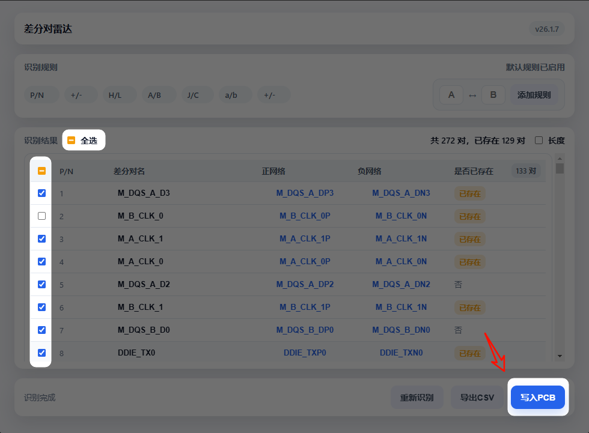
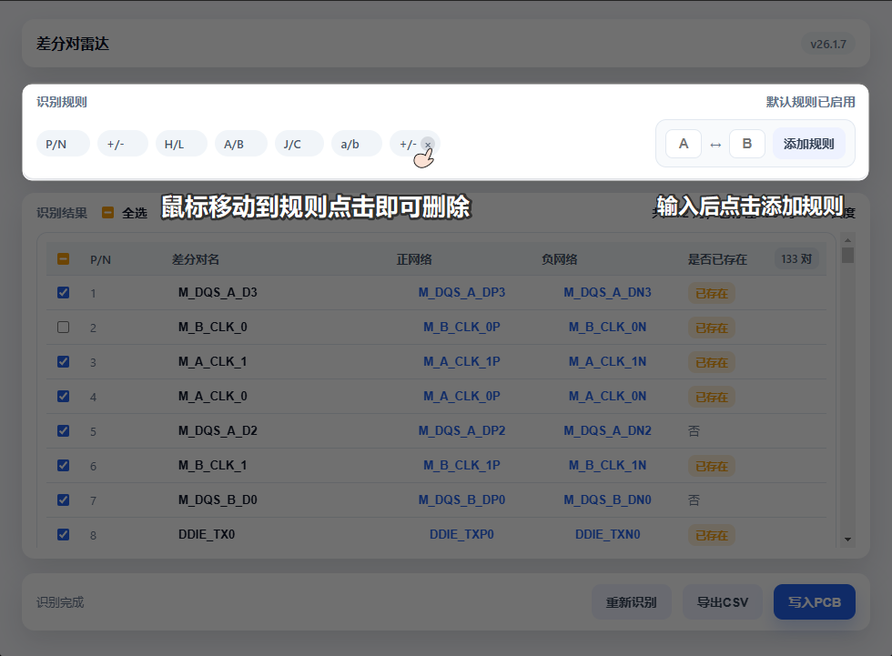
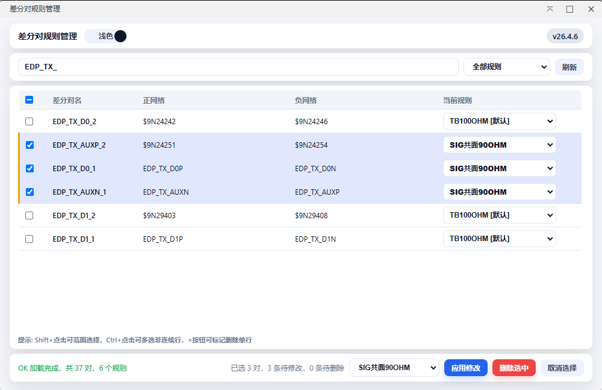
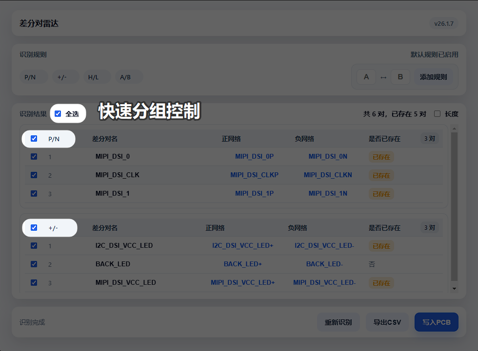
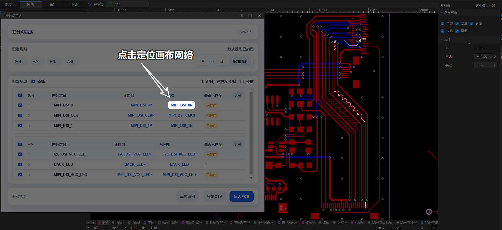
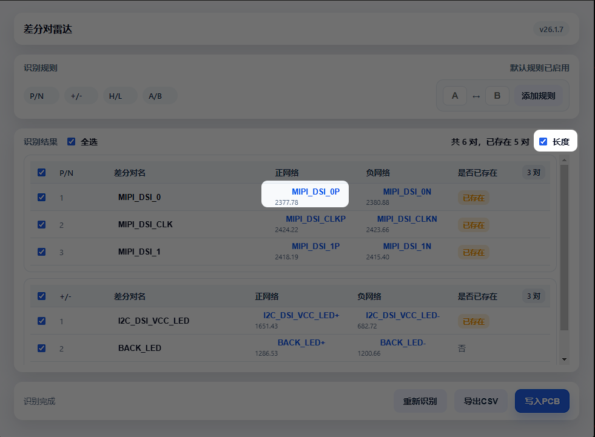
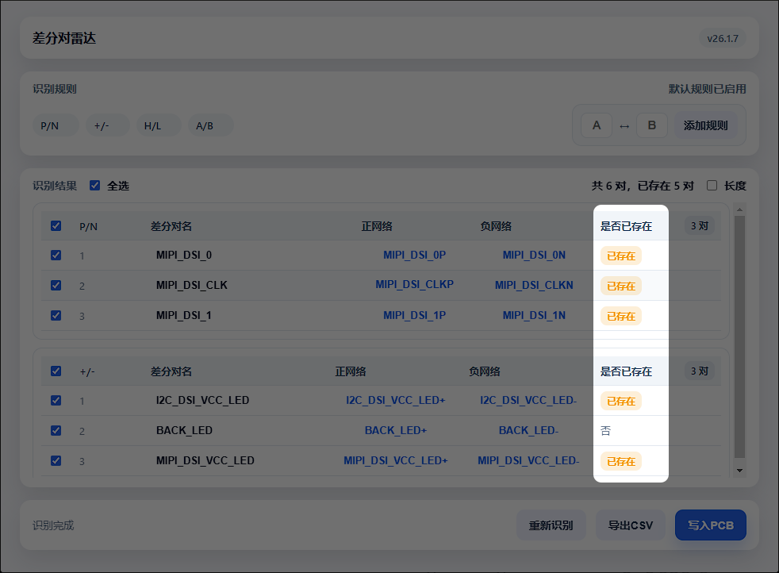
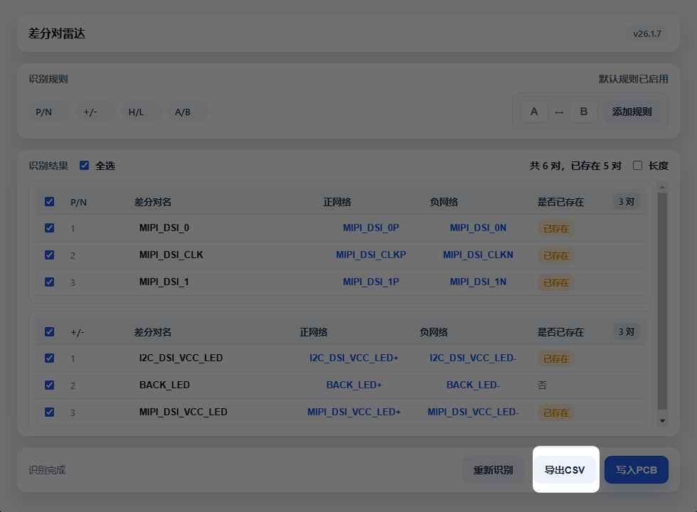

你还在为差分对一个个手动加到手酸而担心吗？  
你还在为”特殊中缀”识别不到而夜不能寐吗？  
快来使用差分对雷达，一键识别、一键写入、一键管理，守护你的腱鞘炎。

## 卖点

自动识别 PCB 差分对，表格化管理，勾选则写入，专治手动重复劳动。
内置规则管理器，支持修改规则、改名、删除差分对。

## 识别规则

- 匹配逻辑：仅输入的字符串不同，其余字符完全一致
- 规则支持多字符输入
- 差分字符位置不限，前缀/中缀/后缀都能识别

## 功能详情

### 一键识别与写入

识别结果勾选后直接写入 PCB，快到让你怀疑人生。  

### 规则管理

默认规则开箱即用，自定义规则随手添加，默认规则也可删除。  

### 差分对管理
  

规则管理器中可修改差分对的规则绑定、名称、以及删除：
- **修改规则**: 每行下拉选择框切换规则，即时预览
- **修改名称**: 点击差分对名直接编辑，自动去重
- **单行删除**: 鼠标悬停显示 × 按钮，点击标记删除
- **批量删除**: 勾选多行后点击"删除选中"，一次性标记

所有修改点击"应用修改"后统一写回，支持撤销前反悔。

### 分组表格与勾选

按规则分组，勾选成批操作，拒绝“逐条点点点”。  

### 网络定位与高亮

点网络名即可定位并高亮，不再迷路。  

### 网络长度双行显示

长度在网络名下方，信息密度更高。  

### 已存在标记

已有差分对一眼可见。  

### 导出 CSV

一键导出识别结果，方便留档与协作。  

## 使用方式

### 差分对雷达
1. 打开 PCB 文件
2. 顶部菜单点击 差分对雷达 → 差分对雷达
3. 插件自动识别并展示分组结果
4. 按需勾选，点击 写入PCB

### 规则管理
1. 顶部菜单点击 差分对雷达 → 差分对规则管理
2. 加载当前 PCB 所有差分对及其规则绑定
3. 修改规则/名称，或标记删除，点击 应用修改

## 功能清单

- 默认规则识别（P/N、P/M、\_H/\_L、DP/DM、\_T/\_C、+/-、∅/#、∅/\_B、\_POS/\_NEG）
- 规则支持多字符、大小写忽略、允许单侧为空
- 规则优先级匹配并按规则分组展示
- 自定义规则添加/删除、回车添加、自动去重与本地持久化
- 默认规则可删除并一键重置
- 识别结果表格化展示，支持全选/分组选择/半选态
- 差分对名可编辑并自动去重生成
- 正/负网络列排序、是否已存在排序
- 网络点击定位：清空选中、清空高亮、选中网络、缩放视图、高亮网络
- 网络长度开关展示并批量读取
- 已存在差分对显著标记，写入时自动跳过
- 写入 PCB 支持进度提示、顺序重试、结果统计（成功/跳过/失败）
- 识别/写入状态提示与图标颜色反馈
- 支持浅色/深色模式切换
- 版本号展示与跳转入口
- 识别结果可导出 CSV（仅导出勾选项）
- 支持独立窗口与嵌入模式（窗口控制按钮）
- 规则管理器：修改差分对规则绑定、在线编辑名称、单行/批量删除
- 规则管理器：修改/改名/删除统一应用，标记-提交模式防误操作
